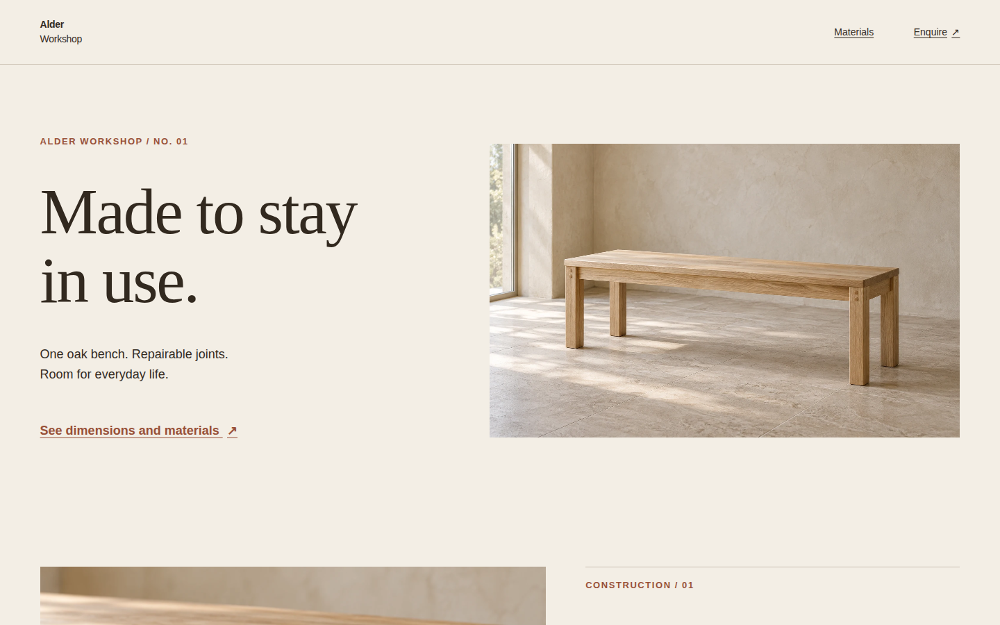
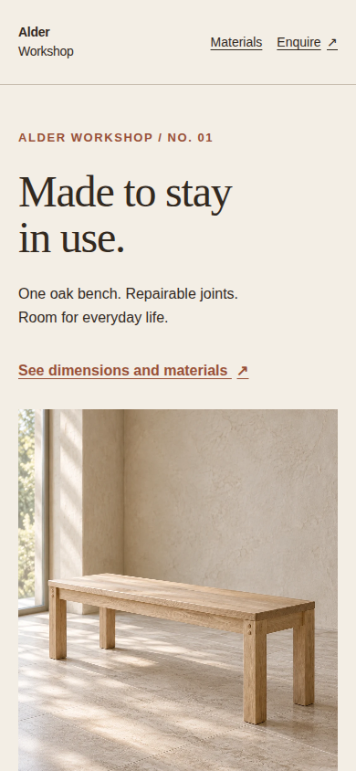
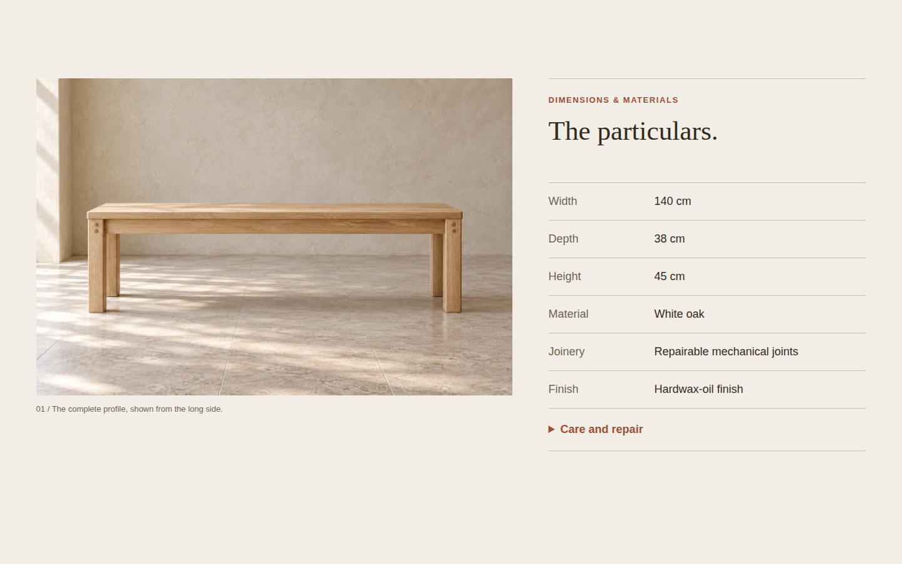
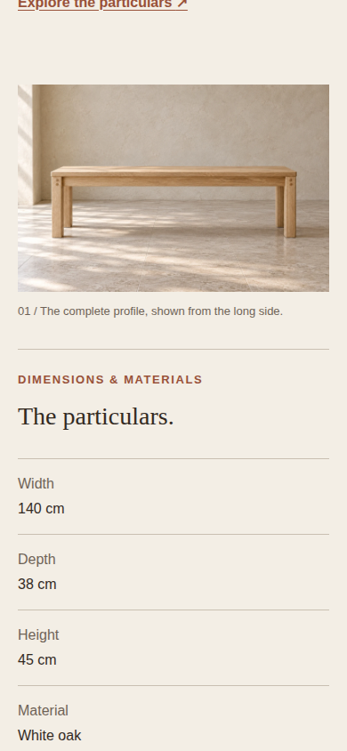
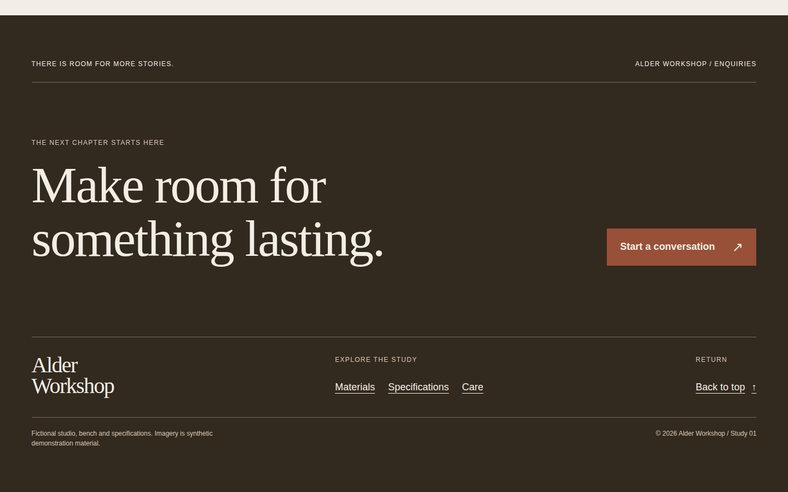
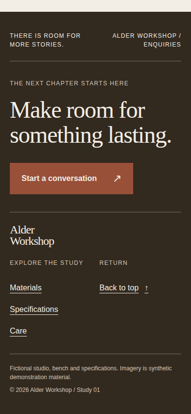

# Alder Workshop — complete editorial composition

A single document joins five native recipes: an art-directed hero, a material story, a product specification, a short editorial care passage and a designed close. It uses original shared imagery, system fonts and one palette. Alder Workshop, its bench, specifications, care claims and imagery are synthetic demonstration material, not manufacturing evidence. [Asset provenance and tokens](../_shared/composition/ASSETS.md).

## Run and reuse

From `plugins/awards/recipes`, run `npm run dev` and open `/complete-editorial-composition/`. From the repository root:

```sh
AWARDS_PLAYWRIGHT=/path/to/playwright node plugins/awards/scripts/verify-recipes.mjs --only complete-editorial-composition
```

`style.css` imports all five component stylesheets. Its own selectors handle only the page frame, masthead, skip link and section spacing; component fixes belong in their source recipes. Reuse `.art-hero`, `.editorial-feature`, `.product-spec`, `.type-specimen--editorial` and `.designed-close` with their own semantic markup. Do not bring `[data-demo]` presentation or standalone diagnostic scripts into a real page.

The hero promises an everyday object; the joint close-up explains the material; the complete profile and `<dl>` provide evidence; the shorter care passage slows the pace before the reversed footer closes it. Figure/caption relationships, real fragments, one h1, skip link and landmarks retain a useful document without JavaScript. `#specification` and `#enquire` are genuine sections, and `#care` is the editorial passage. The contact action is a demonstration `mailto:studio@alder.example`; supply a real address when adapting.

The native care disclosure uses Enter or Space without custom event handlers. `main.js` registers page metrics through the existing hook and waits only for fonts and the hero image. Below-fold detail/profile images load lazily. The typography passage is content, without specimen comparison labels or diagnostic glyphs. The standalone typography recipe supplies the explicit descender/diacritic study.

## Verification boundary

The verifier checks desktop/mobile top, middle and end, reduced-motion middle, and care opened with Enter on each viewport. Shared checks cover overflow, one h1, visible images and local fragments. Page checks cover five rendered sections in order, landmarks, alternative text, six specifications with units, responsive picture choice and the native disclosure state. `capture-states.json` supplies the same care action to the generic capture CLI. The additional 320×844 and 768×1024 captures use its existing viewport flags.

Headless Chromium evidence establishes rendering and behavior at these sizes. It does not establish real-device performance or the shapes of a project's replacement fonts. The warm ground, brown ink, clay accent and coherent oak/stone images are one fictional example world. Replace the whole image family and palette deliberately, then inspect new crops, text measures, section density and the ending together.

## Visual notes

Captured 2026-09-22 from the built page in headless Chromium 153.0.8010.12 on Linux, device scale 1 and system fonts, with normal motion. Desktop is 1440×900 CSS px; mobile is 390×844 CSS px with touch/mobile emulation. These six unedited PNGs are below 1 MiB each. The standard capture positions are 0%, 50% and 100% of the scrollable document, so middle frames are evidence of the specification and close frames show the footer. Reviewed: no material overflow, crop or hierarchy defect in these frames.

### Desktop opening



Top, scroll 0%.

- Hierarchy: the two-line proposition and the complete bench carry equal visual weight; navigation stays quiet above them.
- Alignment: the masthead and hero copy repeat the left gutter, while picture and navigation finish at the right gutter.
- Crop: the wide 8:5 photograph retains the bench silhouette and all feet, with useful wall and floor around it.
- Measure and whitespace: short explanatory copy and a separate action sit beneath the title; a generous pause reveals the next image at the lower edge.
- Recomposition: desktop uses an asymmetric copy/image row; mobile presents the same copy and action before a portrait view.

### Mobile opening



Top, scroll 0%. The picture continues below the viewport; its seat and feet are already visible.

- Hierarchy: the serif title still leads, and the clay specification link supplies a clear next step before the image.
- Alignment: wordmark, title, action and portrait repeat a 20px inset; both masthead links remain visible.
- Crop: the portrait source gives the bench room within the 4:5 frame, preserving all four feet rather than squeezing the wide image.
- Measure and whitespace: two title lines and two body lines are separated by deliberate gaps; the page does not force all hero content into one screen.
- Recomposition: the desktop columns become copy, action and image in document order, with no visual reordering.

### Desktop middle



Middle, scroll 50%; care disclosure closed.

- Hierarchy: the complete profile anchors the left, with the quieter serif heading introducing a dense factual register on the right.
- Alignment: the image top aligns with the specification rule; term and value columns repeat down six rows.
- Crop: the natural 3:2 profile shows seat, legs and floor clearance; the close joint crop from the preceding story is no longer used here.
- Measure and whitespace: the figure caption sits close to its image; widely separated rows retain legible units and construction phrases.
- Recomposition: desktop shows profile and facts together, while mobile makes them a single sequence and moves values beneath labels.

### Mobile middle



Middle, scroll 50%. The preceding story link is at the upper edge; joinery, finish and care continue below the visible material row.

- Hierarchy: the product silhouette leads into the section title and then the quieter labelled facts.
- Alignment: profile, caption, rule and fact register all follow the same 20px gutter.
- Crop: the full side profile remains visible at its native 3:2 ratio, with no decorative cut into the product.
- Measure and whitespace: the caption stays adjacent to its figure; stacked label/value pairs provide room for longer construction text lower down.
- Recomposition: the two desktop columns become an image-first document sequence, and fact pairs stack vertically rather than becoming tiny side-by-side columns.

### Desktop close



Final viewport, scroll 100%.

- Hierarchy: a large reversed invitation resolves the story, with one clay enquiry action on its right.
- Alignment: the overline, message, signature and provenance share the opening page’s gutter; lower navigation uses its own aligned columns.
- Crop: this is an intentionally image-free conclusion; the earlier product views have already established the object.
- Measure and whitespace: the two-line statement and broad space before the lower rule create a slower ending without hiding the contact route.
- Recomposition: the side-by-side heading and action become a vertical pair on mobile; the three lower columns condense into signature plus two navigation columns.

### Mobile close



Final viewport, scroll 100%; the whole footer fits at 390×844.

- Hierarchy: the two-line invitation leads directly to the clay action, followed by a smaller workshop signature.
- Alignment: title, action, signature and colophon share the left edge; study navigation and return link occupy separate columns.
- Crop: there is no photograph to distract from the closing action; both the first overline and final demo colophon are visible.
- Measure and whitespace: the heading stays readable at 48px, rules divide the closing roles, and short text blocks keep the ending compact.
- Recomposition: the contact action moves below the title, the signature spans both lower columns, and section links become a vertical list.

Additional 320×844 and 768×1024 browser frames were inspected at top, middle and end. At 320px the footer is naturally taller than one viewport, so its overline begins above the final frame; the contact action and navigation remain readable and reachable. At 768px the wide layouts start, the product retains its complete silhouette, long specification values wrap, and care/close retain distinct columns. Material-story and care-passage captures at all four widths confirmed their order, readable wraps and intact resting text. These additional raw captures remain in the ignored verification output or OS temporary capture directories.

An unsuccessful alternative would give every section the same two-column photograph-and-heading template, or mask a component’s bad wrap with a page-only override. When adapting, choose a coherent subject and image family, vary density according to the content, replace the synthetic facts and contact route, and inspect opening, material story, specifications, care and close together. The component sources own their responsive layouts; the complete page owns only sequencing and pace.
