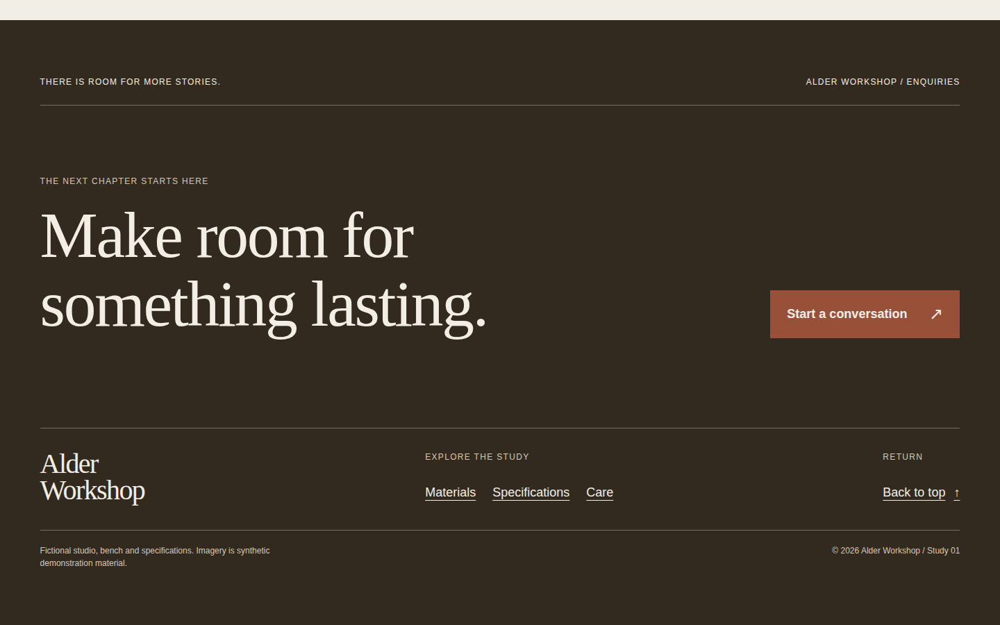
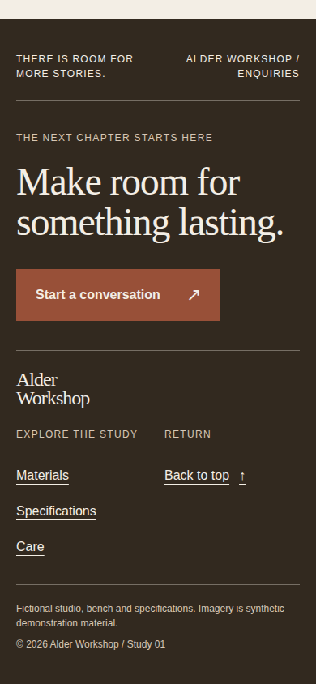

# Alder Workshop — designed close

An authored ending for a fictional furniture study. The footer carries a short proposition, a real `mailto:` enquiry link, three links back into the page, a native `#top` return, and a small demo colophon. There is no form or email submission script.

Run from `plugins/awards/recipes` with `npm run dev`, then open `/designed-footer/`. From the repository root, verify with:

```sh
AWARDS_PLAYWRIGHT=/path/to/playwright node plugins/awards/scripts/verify-recipes.mjs --only designed-footer
```

Reuse the `.designed-close` footer with `style.css` rules under the same scope and give its section links real targets in the consuming page. The standalone introduction, material image, specifications and care text provide enough context to show the closing chapter in sequence. The section keeps the page's only closing `h2`; the page's one `h1` is in its introduction. The enquiry target is at least 44 × 44 CSS pixels and uses a visible keyboard outline. The only script registers verifier metrics through the shared awards hook.

The example uses the shared warm-ground, brown-ink and clay-accent system and system fonts. The reversed footer text has 12.3403:1 ink/ground contrast; the clay action has 5.1339:1 ground/accent contrast. The pale focus outline is visible against both the clay action and dark footer. The product image is synthetic demonstration imagery documented in [ASSETS.md](../_shared/composition/ASSETS.md). Alder Workshop, the bench, dimensions and care claims are fictional. The illustration is not manufacturing evidence.

The verifier captures top, preceding context, final viewport and keyboard-focus states at desktop 1440 × 900 and mobile 390 × 844, checking fragments, image decoding, heading count, overflow, link name, focus outline and target size. Headless browser captures demonstrate rendering and behavior at those sizes, not real-device performance.

## Visual notes

Captured 2026-09-22 from the built page in headless Chromium 153.0.8010.12 on Linux, device scale 1, system fonts, normal motion. Desktop is 1440×900 CSS px; mobile is 390×844 CSS px with touch/mobile emulation. All published PNGs are unedited browser screenshots under 1 MiB. Reviewed for hierarchy, aligned edges, crop, whitespace and responsive order; no material defect was found in these frames.

### Desktop



Final viewport; scroll 100%.

- Hierarchy: the large reversed statement dominates the dark field; a clay contact action balances its right side.
- Alignment: overline, heading, signature and colophon repeat the left gutter; the action aligns with the statement’s lower edge.
- Crop: this ending deliberately contains no image, allowing the product photography earlier in the document to resolve into a direct invitation.
- Measure and whitespace: two statement lines and broad space above the lower rule create a slower final beat without burying navigation.
- Recomposition: the desktop message/action row becomes a vertical stack on mobile, while the complete close remains within its final viewport.

### Mobile



Final viewport; scroll 100%.

- Hierarchy: the two-line serif invitation is followed immediately by a high-contrast contact action.
- Alignment: the heading, button, signature and colophon share the left edge; study and return links sit in separate columns.
- Crop: the image-free dark field is intentional; the full closing section, including the demo colophon, is present in this frame.
- Measure and whitespace: the short line length retains readable heading scale, and the compact rules separate message, navigation and provenance.
- Recomposition: the action drops below the heading, the signature takes a full row, and study links stack into reachable vertical targets.

An unsuccessful alternative would tack on a generic link grid after the story, with no clear next action. For another subject, write a specific closing proposition, supply a real contact destination and retune its heading and navigation at narrow widths.
