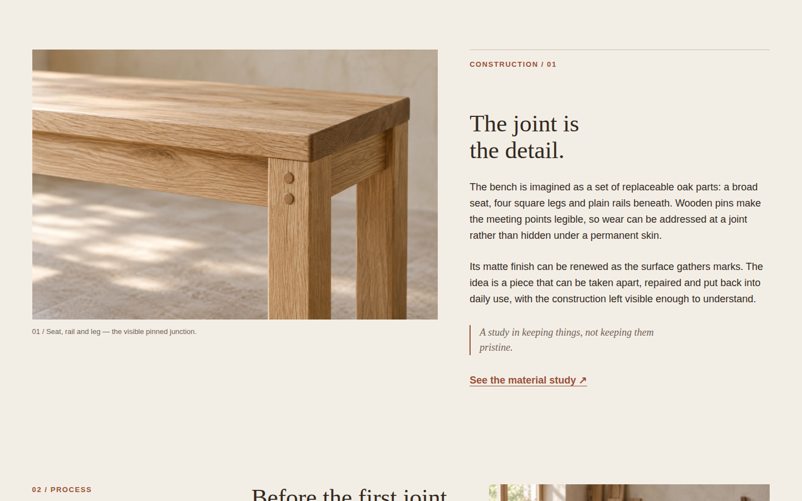
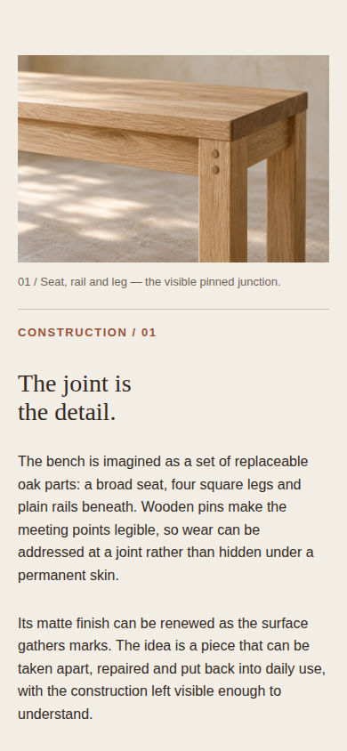

# Alder Workshop — editorial image and text

A static editorial composition for a fictional repairable oak bench. The figure leads, then a caption explains the visible joint; two short paragraphs describe the construction and a quieter note closes the thought. The page uses native grid and local links. Its only JavaScript registers verifier state and signals readiness after fonts settle.

## Run and reuse

From `plugins/awards/recipes`, run `npm run dev` and open `/editorial-image-text/`. To verify this entry from the repository root:

```sh
AWARDS_PLAYWRIGHT=/path/to/playwright node plugins/awards/scripts/verify-recipes.mjs --only editorial-image-text
```

Copy the `.editorial-feature` section, its scoped styles, and the `editorial-figure` / `editorial-copy` markers. The figure and caption precede the copy in document order. Above 48rem the grid assigns the figure 1.35 parts and the copy 1 part, with the shared gutter between them and their top edges aligned. The caption stays inside the figure, directly below its image. Below 48rem the grid becomes one column, so a phone presents image, caption, heading, paragraphs and note in the same order as the markup. Keep the caption attached to its figure when adapting the section.

The joinery view is 1536 × 1024 and has explicit HTML dimensions, meaningful alternative text and `loading="lazy"` because the feature starts below the first viewport. The later workshop view uses the same dimensions and lazy loading. Both are original synthetic demonstration images documented in [ASSETS.md](../_shared/composition/ASSETS.md). The fixed palette and system type stacks come from `composition.css`, imported after `base.css`. The opening panel, process section and footer demonstrate a complete page; a consuming page can provide its own surroundings and destination for the material-study link.

Desktop 1440 × 900, phone 390 × 844 and reduced-motion desktop captures check columns or reading order, caption placement, image decoding, one heading, overflow, visible images and local anchors. The captures are browser evidence at those sizes, not real-device performance evidence.

Alder Workshop, the bench, dimensions, construction claims and imagery are synthetic demonstration material. The pictures illustrate an idea and are not manufacturing instructions or proof of a built product.

## Visual notes

Captured 2026-09-22 from the built page in headless Chromium 153.0.8010.12 on Linux, device scale 1, system fonts, normal motion. Desktop is 1440×900 CSS px; mobile is 390×844 CSS px with touch/mobile emulation. All published PNGs are unedited browser screenshots under 1 MiB. Reviewed for hierarchy, aligned edges, crop, whitespace and responsive order; no material defect was found in these frames.

### Desktop



Feature view; scroll 60% of the scrollable document.

- Hierarchy: the enlarged joint at left is the first evidence; the intermediate serif heading introduces the explanation at right.
- Alignment: the image top and the copy’s thin top rule align; the caption stays on the image’s left edge.
- Crop: the original 3:2 detail intentionally excludes the full bench but retains the paired pins, rail and seat junction.
- Measure and whitespace: the two paragraphs stay in a roughly 58ch column; the italic note has a separate clay rule and breathing room.
- Recomposition: the unequal columns collapse to figure, caption and prose on mobile; the process section only starts at this frame’s lower edge.

### Mobile



Feature view; scroll 50%. The note and process link continue below this frame.

- Hierarchy: the image establishes the subject before the construction label and two-line heading explain it.
- Alignment: figure, caption, rule and text share a 20px left inset; the caption is visibly attached to its figure.
- Crop: the natural 3:2 image preserves the same junction and pins without a new phone crop.
- Measure and whitespace: full-width 16px paragraphs keep comfortable leading and a clear paragraph gap.
- Recomposition: the figure precedes the copy instead of sitting beside it; lower supporting content remains in normal vertical flow.

An unsuccessful alternative would use a full-width paragraph under an unrelated decorative image. For another subject, choose evidence the prose actually explains, rewrite its caption and retune the column proportions to the new image and text length.
