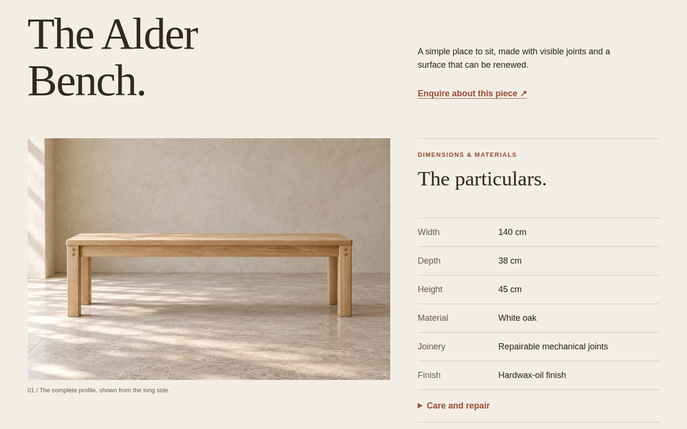
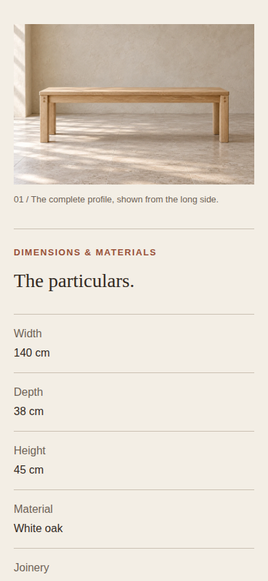

# Alder Workshop — product specification

A complete static product page for a fictional oak bench. The profile image sits beside a six-pair specification register on wide screens and precedes it in document order on phones. The care disclosure uses native `<details>` and `<summary>` so keyboard activation and open state need no custom interaction code. The page's JavaScript only registers verifier state and signals readiness after the image and fonts decode.

## Run and reuse

From `plugins/awards/recipes`, run `npm run dev` and open `/product-specification/`. To verify this entry from the repository root:

```sh
AWARDS_PLAYWRIGHT=/path/to/playwright node plugins/awards/scripts/verify-recipes.mjs --only product-specification
```

Copy the `.product-spec` section and its scoped styles. Its `<dl>` contains six adjacent term/description pairs: width 140 cm, depth 38 cm, height 45 cm, white oak, repairable mechanical joints and a hardwax-oil finish. Labels and units are real text. At 48rem and above the profile and facts occupy columns, while each term and description occupy separate grid columns. Below 48rem the profile, label and value follow the DOM's reading order. The local enquiry action resolves to the readiness section; replace that destination with a real enquiry route in a deployed site.

The profile view is 1536 × 1024 and has explicit HTML dimensions and meaningful alternative text. It is original synthetic demonstration imagery documented in [ASSETS.md](../_shared/composition/ASSETS.md). The page imports `composition.css` after `base.css`; both use system fonts. No JavaScript controls the disclosure.

Desktop 1440 × 900 and phone 390 × 844 captures check image decoding, profile/facts layout, the six facts and units in DOM text, anchor resolution and Enter activation of the care disclosure. These headless browser captures prove rendering and behavior at those sizes, not real-device performance.

Alder Workshop, the bench, specifications, construction and care claims, availability and imagery are synthetic demonstration material. The images are not photographs of a manufactured product or evidence of its joinery.

## Visual notes

Captured 2026-09-22 from the built page in headless Chromium 153.0.8010.12 on Linux, device scale 1, system fonts, normal motion. Desktop is 1440×900 CSS px; mobile is 390×844 CSS px with touch/mobile emulation. All published PNGs are unedited browser screenshots under 1 MiB. Reviewed for hierarchy, aligned edges, crop, whitespace and responsive order; no material defect was found in these frames.

### Desktop



Specification view; scroll 25%. The opening eyebrow is above the frame.

- Hierarchy: the large product name precedes the profile and the quieter “The particulars” register.
- Alignment: profile top meets the facts’ top rule; the image caption stays with the left column while values form a separate right column.
- Crop: the natural 3:2 side view shows the complete seat, legs and floor clearance without a cut-off foot.
- Measure and whitespace: ruled rows make six facts easy to scan, and the closed care summary has its own generous hit area.
- Recomposition: desktop pairs term and value across each row; mobile stacks each pair after the image so long material facts can wrap.

### Mobile



Specification view; scroll 35%. Joinery starts at the lower edge; finish and the care summary follow below.

- Hierarchy: the complete profile leads into the label and serif section heading before the fact list.
- Alignment: image, caption, heading and register share the 20px gutter; each value aligns beneath its label.
- Crop: the bench remains complete in its natural 3:2 frame, with ample pale wall and floor.
- Measure and whitespace: separated label/value pairs avoid squeezing “Repairable mechanical joints” into a narrow second column.
- Recomposition: the image and facts become one reading sequence; this viewport shows width, depth, height and material, with more facts below.

An unsuccessful alternative would replace units and labels with decorative counters. For another product, use verified facts, truthful care instructions and a matching profile; retest the longest label/value and the open disclosure.
