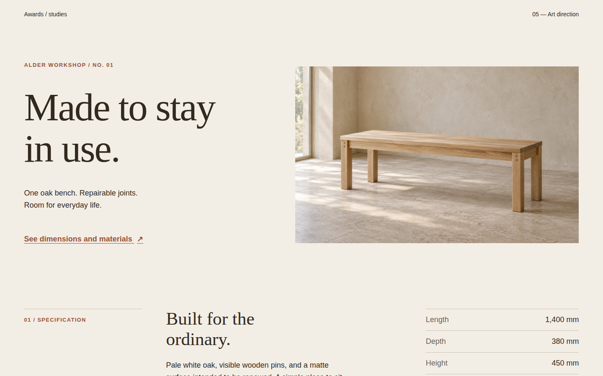
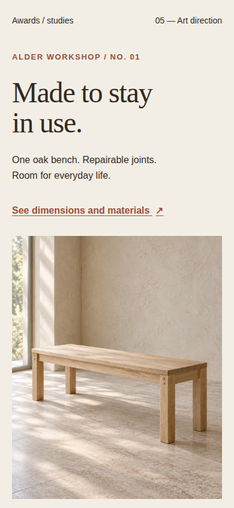

# Alder Workshop — responsive art-directed hero

An original, static `<picture>` recipe. A wide view and a separately composed portrait view of the same fictional oak bench serve the same headline, copy and action. The browser chooses the image at a 48rem boundary; no resize script or image library is needed.

## Run

From `plugins/awards/recipes`, run `npm run dev` and open `/responsive-art-directed-hero/`. From the repository root:

```sh
AWARDS_PLAYWRIGHT=/path/to/playwright node plugins/awards/scripts/verify-recipes.mjs --only responsive-art-directed-hero
```

The page remains readable and its specification link works without JavaScript. `main.js` only registers verifier state, waits for the chosen image to decode and fonts to settle, then calls `awards.ready()`.

## Image and reading order

The `<source>` chooses `hero-portrait.webp` below 48rem; the `` fallback supplies `hero-wide.webp` above it. Source dimensions are 1024 × 1536; fallback dimensions are 1586 × 992. Both images are original synthetic demonstration material, documented in [ASSETS.md](../_shared/composition/ASSETS.md). They are different compositions of the same product, not crops cut from one file. The CSS reserves an 8:5 desktop frame and a 4:5 phone frame before decoding. `object-fit: cover` preserves those frames.

The headline, explanation and action come before the image in both DOM and visual order. A reader reaches the proposition and its destination first; on a phone the product view follows immediately. No CSS `order` reversal creates a different keyboard or screen-reader sequence. The desktop wide source nearly matches the 8:5 frame exactly. The portrait source has spare wall above and floor below the complete bench; visual review at 390px confirmed that centered 4:5 cropping keeps the seat and all four feet visible, so its focal position remains centered. Retune `object-position` after inspecting replacement art, especially the feet and the action-to-image transition.

Copy the `.art-hero` section with its `hero-copy` and `hero-media` layout markers. The component uses `.composition-title` and `.composition-copy` from shared tokens. The `[data-demo]` wrapper, masthead, specification section and footer are standalone presentation; a consuming page provides its own destination for the action. Keep the hero's text and media in that document order. Its `main.js` is diagnostic and need not be imported by a larger page; register that page's own state through the shared hook.

The warm ground, brown ink, clay action and system fonts come from `composition.css`, imported after `base.css`. [ASSETS.md](../_shared/composition/ASSETS.md) records palette contrast and asset provenance. [The Line site card](../../references/sites/the-line.md) illustrates how a single hero can establish an art direction; this example does not copy its imagery, copy or layout.

## Verification boundary

The verifier directly exports the shared layout probe. Desktop 1440 × 900, phone 390 × 844 and reduced-motion desktop states assert the selected source, decoded intrinsic dimensions, reading order, reserved frame ratio, one h1, no horizontal overflow, no broken visible image and working local links. The verifier writes captures and machine results to ignored `recipes/_verify/` and stamps metadata after a passing run. Browser captures support visual review of these two viewports; they do not prove every intermediate width or real-device performance.

Alder Workshop, the white-oak bench, all construction claims, dimensions and imagery are synthetic demonstration material. The pictures are not evidence of a manufactured product or instructions for making one.

## Visual notes

Captured 2026-09-22 from the built page in headless Chromium 153.0.8010.12 on Linux, device scale 1, system fonts, normal motion. Desktop is 1440×900 CSS px; mobile is 390×844 CSS px with touch/mobile emulation. All published PNGs are unedited browser screenshots under 1 MiB. Reviewed for hierarchy, aligned edges, crop, whitespace and responsive order; no material defect was found in these frames.

### Desktop



Top; scroll 0%.

- Hierarchy: the two-line serif title at left balances the complete bench at right; the clay action remains distinct below the shorter explanation.
- Alignment: the eyebrow, title, prose and action share the left gutter; the picture and lower specification register share the right edge.
- Crop: the 8:5 frame retains the whole seat and all four feet, with floor beneath; the quiet wall gives the product breathing room.
- Measure and whitespace: short copy occupies two lines while the wide gap above the specification marks a new chapter.
- Recomposition: this side-by-side arrangement becomes copy, action, then portrait on mobile; the document order does not change.

### Mobile



Top; scroll 0%.

- Hierarchy: the 48px serif headline still leads, followed by two lines of explanation and the clearly underlined action.
- Alignment: every content block meets the same 20px inset, including the full-width picture.
- Crop: the portrait source fills a 4:5 frame; seat, pins and feet remain visible with extra wall above.
- Measure and whitespace: two title lines and distinct gaps keep copy from merging into the photograph.
- Recomposition: the action appears before the portrait instead of beside it, preserving a readable first decision at phone width.

An unsuccessful alternative would squeeze the landscape into the phone frame and cut off the feet. For another subject, supply a deliberate portrait and inspect its focal point, action length and heading wrap.
