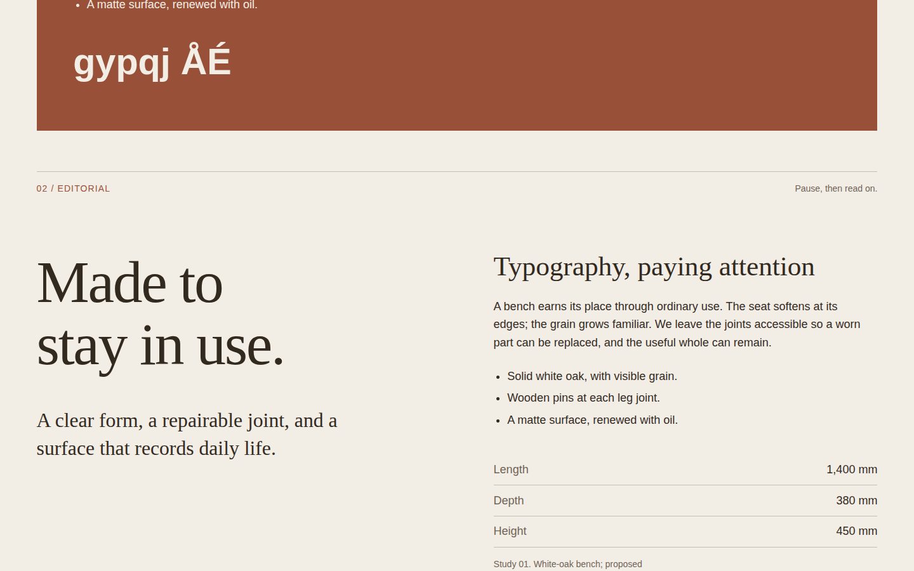
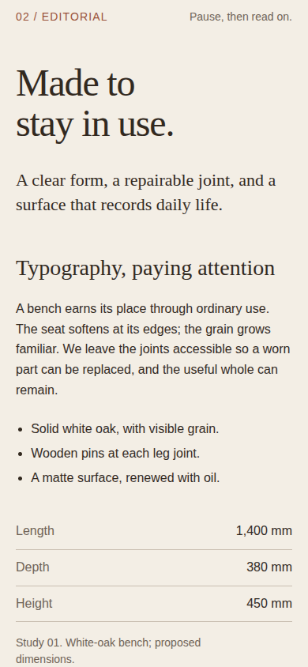

# In good order — three typographic voices

An original, static comparison of poster, editorial and technical hierarchy. Each section contains exactly the same title, lead, paragraph, list, dimensions, caption and diagnostic text. The comparison changes the treatment, not the argument.

## Run

From `plugins/awards/recipes`, run `npm run dev` and open `/typography-specimen/`. From the repository root:

```sh
node plugins/awards/scripts/verify-recipes.mjs --only typography-specimen
```

No recipe dependency, font download, raster image, animation or rendering library is required. Content and fragment navigation work without JavaScript. `main.js` registers diagnostic metrics, waits for `document.fonts.ready`, and calls the shared `awards.ready()` hook.

## What changes between treatments

| Treatment | Decision | Intended reading |
|---|---|---|
| Poster | Bold system sans, large two-line statement, offset lead and clay field; supporting copy remains normal reading size | Recognize the proposition first, then examine its evidence |
| Editorial | Georgia display and lead; two balanced columns above 48rem, intermediate heading and generous paragraph leading | Move from a proposition into a slower material story |
| Technical | Compact sans statement, restrained rules, system monospace dimensions and tabular figures | Find facts quickly without giving up the explanatory paragraph |

**Font character** is the shape and texture of the letters: Georgia's serifs, the neutral sans forms, or the evenly spaced technical figures. **Hierarchy** is the relation among sizes, weights, measure, placement and space. Changing fonts alone does not establish a reading order. The poster and technical treatments use the same sans stack for their headings yet establish very different priorities.

These are examples, not mandatory scales. The supporting [The Line site card](../../references/sites/the-line.md) documents a strong display contrast and a full intermediate ladder. `seenIn` credits that typographic principle; it does not claim that this page, copy or layout appeared there. All three compositions and the prose are original.

## Settings and glyphs

`style.css` imports shared `base.css`, then `composition.css`, then scoped rules. The prepared warm ground, brown ink and clay accent belong to this fictional product world. Contrast: ink/ground 12.3403:1, muted/ground 5.1269:1, ground/clay 5.1339:1; low-contrast rules are decorative. Token provenance and calculation notes are in [ASSETS.md](../_shared/composition/ASSETS.md).

| Setting | Desktop at 1440px | Phone at 390px |
|---|---|---|
| Poster title | 144px / 1.02, weight 700, tracking −.055em | 56px / 1.02 |
| Editorial title | 93.6px / 1.05, weight 400, tracking −.025em | 48px / 1.05 |
| Editorial intermediate heading | 43.2px / 1.12 | 28px / 1.12 |
| Technical title | 40px / 1.12, weight 600 | 40px / 1.12 |
| Reading copy | 18px / 1.6, at most 58ch | 16px / 1.6 |
| Annotations and captions | 14px / 1.5 | 14px / 1.5 |

The editorial title and heading use `.composition-title` and `.composition-heading` directly; their values come from the shared stylesheet. Paragraphs use `.composition-copy` with a narrower 58ch ceiling. The display stack is `Georgia, "Times New Roman", serif`; body is `"Helvetica Neue", Helvetica, Arial, sans-serif`; technical figures use `ui-monospace, "SFMono-Regular", Menlo, monospace`. Actual faces and wrapping depend on the OS. No font files ship. Choose a licensed project face and inspect it again rather than treating a system fallback as a precise replacement.

`Typography, paying attention` appears as a real intermediate heading in every treatment; `gypqj ÅÉ` tests descending strokes and accents in each treatment's display voice. Their containers have natural heights and no clipping or masks. Leading was retained after inspecting the actual browser frames, not reduced to match a reference-site ratio. Mobile keeps normal document order: title, lead, heading, prose, list, figures, caption, glyphs. No hard-coded line breaks force a desktop composition onto a phone.

## Adaptation interface

Copy a `.type-specimen` section and the desired `--poster`, `--editorial` or `--technical` modifier. Keep `.type-specimen__intro`, `__body`, `__reading`, `__title`, `__lead`, `__heading`, `__copy`, `__list`, `__figure`, `__facts` and `__glyphs` as needed. The editorial variant expects the shared composition classes on its title and intermediate heading. Semantic heading levels can change for the consuming page while retaining those classes. A complete page should use its own meaningful care passage, not reproduce the comparison annotations or diagnostic strings.

All standalone header, navigation, sample labels and colophon styles are under `[data-demo]`; that wrapper is not part of the reusable component. The reusable class rules add no page-level layout override. The shared imports intentionally supply the same example-world tokens to each importing recipe. Do not import this demo's `main.js` into the complete page: register that page's own metrics through the existing hook.

Alder Workshop, the white-oak bench, its construction claims and dimensions are synthetic demonstration material. They are not manufacturing instructions. This specimen uses no imagery.

## Verification boundary

The verifier directly exports the shared `probeLayout` and calls `assertLayout`. Eleven states cover desktop 1440×900 and mobile 390×844 at top, quarter, middle, three-quarter and end, plus reduced motion at the desktop middle. Content checks require three complete identical specimens, both diagnostic strings, list, paragraph, caption and units. Runtime metrics flag clipping/masking ancestors and hidden computed styles on resting specimen text, including off-screen text. Shared checks cover horizontal overflow, one h1, images and local fragments; the runner checks errors and the hook.

These assertions supplement visual inspection. They cannot prove attractive glyph shapes, optical alignment, perfect line breaks, font rasterization on every OS, or real-device performance. Raw captures and machine reports stay in ignored `recipes/_verify/`; metadata is stamped only by a passing run. The Task 4 report records the red/green evidence and actual inspection.

## Visual notes

Captured 2026-09-22 from the built page in headless Chromium 153.0.8010.12 on Linux, device scale 1, system fonts, normal motion. Desktop is 1440×900 CSS px; mobile is 390×844 CSS px with touch/mobile emulation. All published PNGs are unedited browser screenshots under 1 MiB. Reviewed for hierarchy, aligned edges, crop, whitespace and responsive order; no material defect was found in these frames.

### Desktop



Editorial comparison; scroll 50%. The bottom of the poster is visible above, and the editorial caption continues below.

- Hierarchy: a large editorial serif proposition at left sits against an intermediate heading and smaller evidence at right.
- Alignment: title and reading column begin on the same visual tier; right-aligned dimensions establish a second stable edge.
- Crop: no photograph is used. The viewport includes intact poster “gypqj ÅÉ” at top; content at the viewport edges continues naturally rather than being masked.
- Measure and whitespace: the broad central gap separates proposition from explanation, while the paragraph stays inside a readable 58ch ceiling.
- Recomposition: desktop uses two editorial columns; mobile brings title, lead, heading and facts into one sequence. The concise annotation avoids a stranded final word.

### Mobile



Editorial comparison; scroll 50%. Diagnostic glyphs follow below the caption.

- Hierarchy: the two-line serif title leads, then the serif lead and intermediate heading remain visibly different from the body copy.
- Alignment: annotation, title, paragraph and list use a common left gutter, while dimensions remain right aligned.
- Crop: no raster image appears; no resting text is masked. The caption reaches the bottom edge and the glyph study continues below.
- Measure and whitespace: the paragraph becomes several short 16px lines with generous leading; large gaps separate lead, body and facts.
- Recomposition: the two desktop columns stack without changing content or adding forced line breaks, and “Pause, then read on.” fits one annotation line.

An unsuccessful alternative would keep the poster’s large scale for technical facts or tighten leading until accents collide. For another subject, retain identical test copy across treatments, choose licensed fonts and inspect their real glyphs and wraps again.
